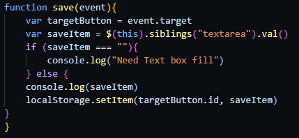
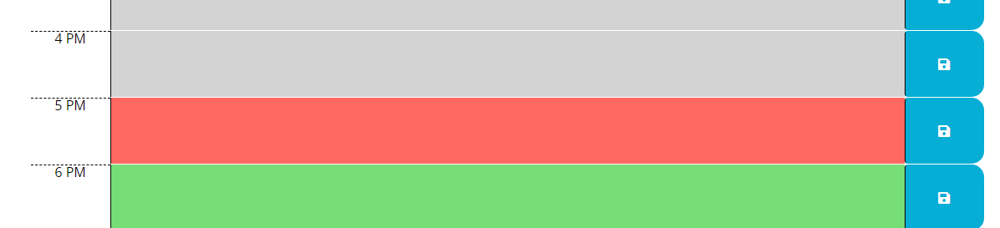

# work-day-planner

 ---

## Description 

## [Deployed Link](https://maverickwong17.github.io/work-day-planner/).

This application is a daily work planner. It will update to show the current day, date, and time. The text blocks will save locally and persist on refresh, as well as color code based on the time.(Grey for past, red for present, green for future timeslots). This is my first implementation of bootstrap, jquery, and other 3rd party web APIs.

## Table of Contents (Optional)

If your README is very long, add a table of contents to make it easy for users to find what they need.

* [Installation](#installation)
* [Usage](#usage)
* [Credits](#credits)
* [License](#license)

## Installation

Clone repository and run on local machine or use deployed link above

## Usage 

This will keep track of the cuurent date and time, and allow the user to input and plan their day. This will persist on refresh through access of local storage. 

Save button functionality for local storage:

Update color for text boxes based on time of day: 

## Credits

[w3 Schools](https://www.w3schools.com/)

[Momentjs](https://momentjs.com/)

[Bootstrap 4.6](https://getbootstrap.com/docs/4.6/getting-started/introduction/)

[Font Awesome](https://fontawesome.com/v5/search)

[JQuery](https://jquery.com/)

Kavya Mandla

Matt Fiaschetti

Sufyaan Vaidya

## License

MIT License